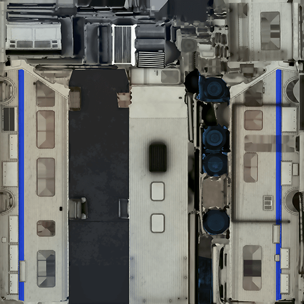

<p align="center">
  
</p>

<h1 align="center">GeraStore</h1>

<p align="center">
  <strong>Русский каталог IPA-приложений для GBox</strong>
</p>

<p align="center">
  <a href="https://gkuhtov.github.io/GeraStore/"></a>
  <a href="https://gkuhtov.github.io/GeraStore/repo.json"></a>
  
</p>

<p align="center">
  by <strong>Гера Кухтов (ГЕРЫЧ)</strong>
</p>

---

## Что это?

**GeraStore** — открытый источник приложений для [GBox](https://gbox.run).  
Здесь собраны полезные IPA, которые можно устанавливать через GBox с самоподписью (`SELF_SIGN`).

Все файлы хранятся в GitHub Releases — быстро, надёжно и бесплатно.

---

## Как добавить источник в GBox

1. Открой **GBox**
2. Перейди в раздел **Источники**
3. Нажми **+** / **Добавить источник**
4. Вставь одну из ссылок:

```
https://gkuhtov.github.io/GeraStore/repo.json
```

или

```
https://raw.githubusercontent.com/gkuhtov/GeraStore/main/repo.json
```

5. Готово — приложения появятся в каталоге

---

## Особенности

| | |
|---|---|
| 🇷🇺 | Полностью русский интерфейс и описания |
| 🎨 | Современный дизайн |
| 📂 | Удобные категории |
| 🔄 | Регулярные обновления |
| 📦 | IPA в GitHub Releases |
| 🔓 | Открытый исходный код |

---

## Ссылки

- **Сайт источника:** [gkuhtov.github.io/GeraStore](https://gkuhtov.github.io/GeraStore/)
- **repo.json:** [прямая ссылка](https://gkuhtov.github.io/GeraStore/repo.json)
- **GitHub:** [gkuhtov/GeraStore](https://github.com/gkuhtov/GeraStore)

---

## Структура репозитория

```
GeraStore/
├── repo.json          ← основной файл источника для GBox
├── index.html         ← красивая страница-лендинг
├── icons/             ← иконки приложений
├── apps/              ← исходные данные
├── generator.py       ← скрипт генерации
└── LICENSE            ← MIT
```

IPA-файлы лежат в **GitHub Releases** (так удобнее работать с большими файлами).

---

## Предупреждение

> Все приложения требуют **самоподписи** (`SELF_SIGN`).  
> Использование неофициальных IPA может нарушать правила App Store и нести риски (бан аккаунта, malware и т.д.).  
> Автор не несёт ответственности. Используйте на свой страх и риск.

---

## Как помочь проекту

- Сообщай о битых ссылках через Issues
- Предлагай новые приложения
- Улучшай описания и скриншоты
- Делай Pull Request’ы

---

<p align="center">
  Сделано с ❤️ для русскоязычного сообщества GBox
</p>
